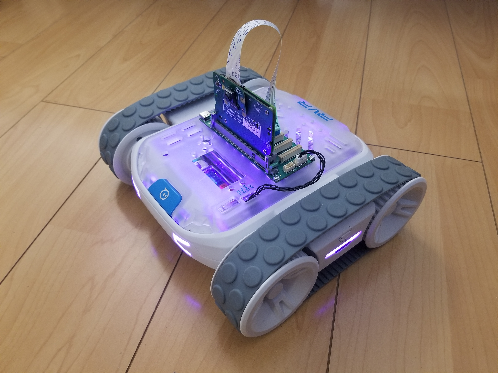

# Demo

# Demo

v4l2loopback Installation

    git clone https://github.com/umlaeute/v4l2loopback
    cd v4l2loopback
    make && sudo make install && sudo depmod -a

Sphero-sdk Installation

    git clone https://github.com/sphero-inc/sphero-sdk-raspberrypi-python
    cd sphero-sdk-raspberrypi-python
    sudo python3 setup.py install

Map ttyS0 to UART4
* Remove all console references in /boot/firmware/cmdline.txt
* Remove “enable_uart = 1” in /boot/firmware/syscfg.txt
* Add “dtoverlay = uart4” in /boot/firmware/usercfg.txt
* Write to /etc/rc.local:

    ~~~
    #!/bin/bash
    ln -s /dev/ttyAMA1 /dev/ttyS0
    ~~~

*       sudo chmod a+x /etc/rc.local

ROS2 Foxy Installation

    sudo apt update && sudo apt install curl gnupg2 lsb-release
    curl -s https://raw.githubusercontent.com/ros/rosdistro/master/ros.asc | sudo apt-key add –
    sudo sh -c 'echo "deb [arch=$(dpkg --print-architecture)] http://packages.ros.org/ros2/ubuntu $(lsb_release -cs) main" > /etc/apt/sources.list.d/ros2-latest.list'
    sudo apt update
    sudo apt install ros-foxy-ros-base
    echo "source /opt/ros/foxy/setup.sh" >> ~/.bashrc

Remotv installation

    git clone https://github.com/remotv/controller.git remotv
    cd remotv/
    sudo apt install ffmpeg python3-serial python3-dev libgnutls28-dev espeak python3-smbus python3-pip git
    wget https://raw.githubusercontent.com/Yoruio/controller/master/hardware/rvrros.py -O hardware/rvrros.py
    cp controller.sample.conf controller.conf

edit controller.conf (https://github.com/remotv/controller -> ‘Configure the controller’)

Opencv Streamer

    sudo apt-get install libopencv-dev python3-opencv
    sudo apt-get install libgstreamer1.0-0 gstreamer1.0-plugins-base gstreamer1.0-plugins-good \
    gstreamer1.0-plugins-bad gstreamer1.0-plugins-ugly gstreamer1.0-libav gstreamer1.0-doc \
    gstreamer1.0-tools gstreamer1.0-x gstreamer1.0-alsa gstreamer1.0-gl gstreamer1.0-gtk3 gstreamer1.0- \
    qt5 gstreamer1.0-pulseaudio
    git clone https://github.com/yoruio/coral-streamer

ROS RVR Node installation

    git clone https://github.com/Yoruio/ros2-rvr-node (run synchronous.py)
